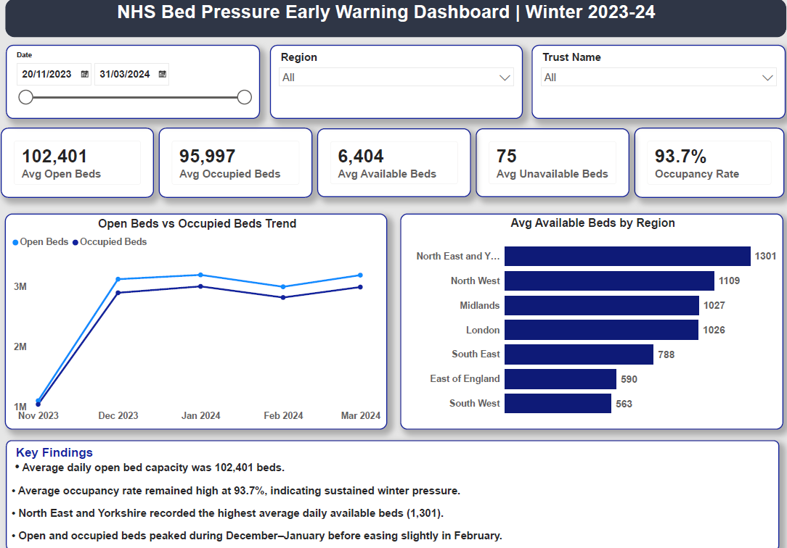
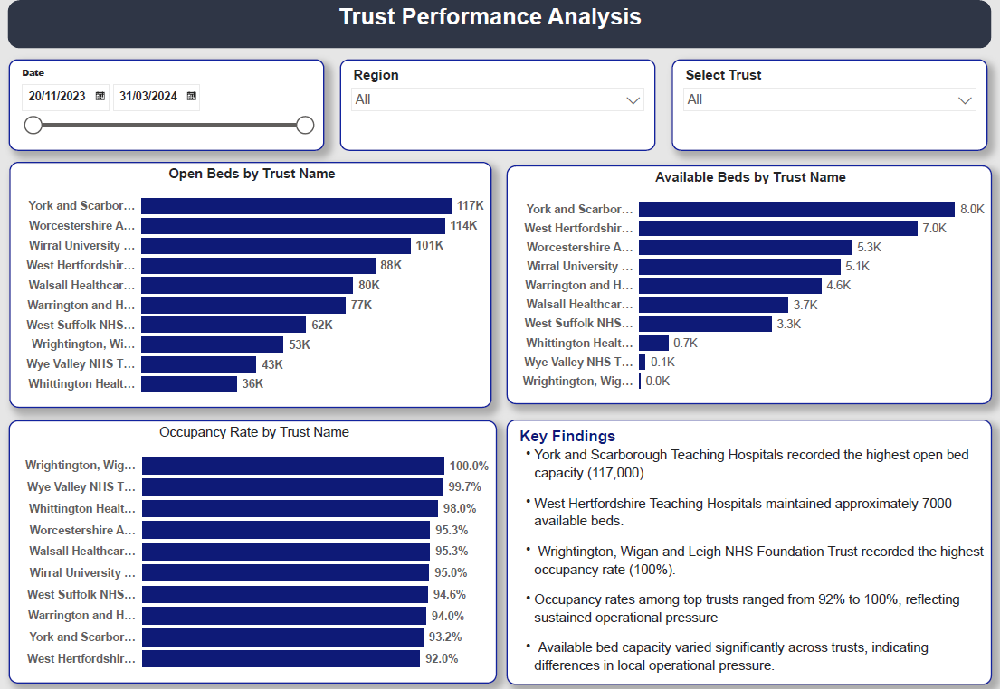
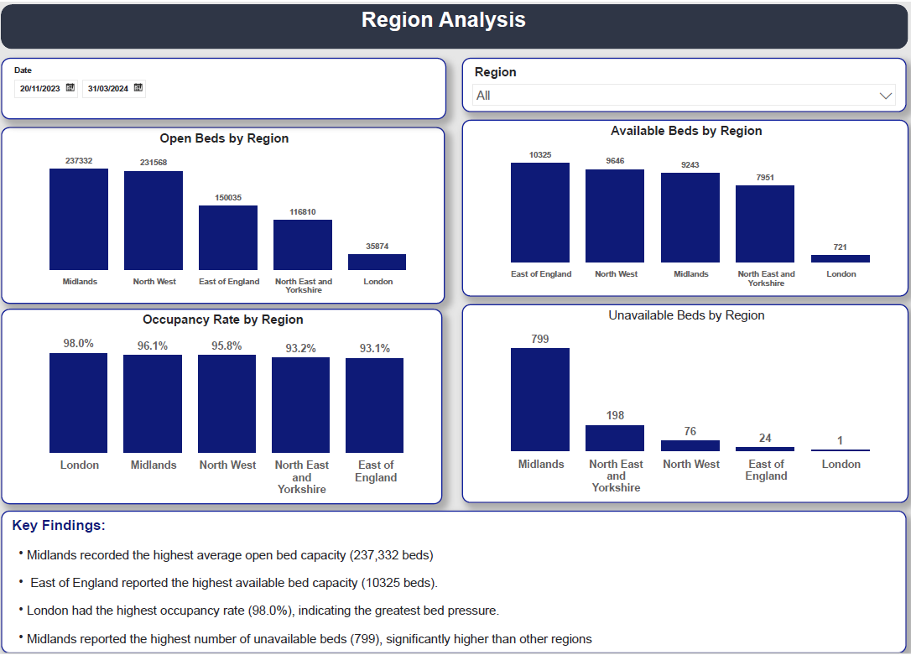
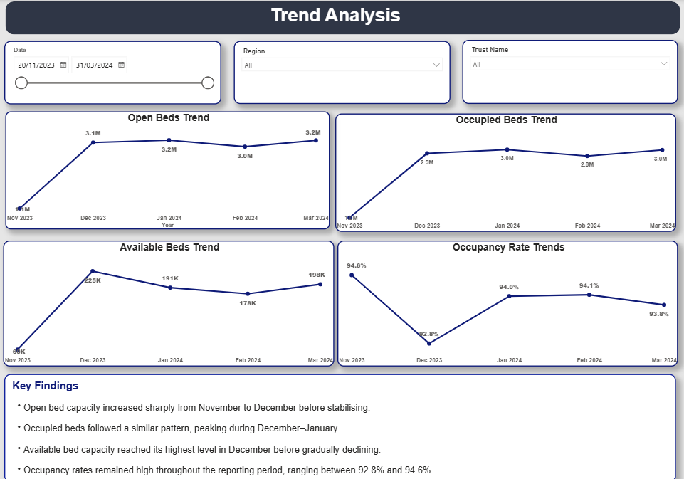

# NHS-Bed-Pressure-Early-Warning-Dashboard
Power BI dashboard analysing NHS bed capacity, occupancy rates and regional healthcare pressure during Winter 2023-24.

## 1. Project Overview

This project presents an interactive Power BI dashboard designed to monitor NHS bed capacity, occupancy rates, and operational pressure across NHS trusts and regions during the Winter 2023–24 period.
The dashboard provides a comprehensive view of bed utilisation by analysing open beds, occupied beds, available beds, unavailable beds, and occupancy rates across multiple levels of the healthcare system. Through trust-level, regional, and trend-based analysis, the dashboard supports healthcare managers and operational teams in identifying pressure points, monitoring performance, and supporting data-driven decision-making.

The objective of the project is to improve visibility into bed capacity management and help stakeholders understand how bed availability and occupancy patterns change over time and across different NHS organisations.

## 2. Business Questions

The dashboard was designed to answer the following key operational and performance questions:

- What was the average daily bed capacity across the NHS during Winter 2023–24?
- How did bed occupancy levels change throughout the reporting period?
- Which NHS trusts operated under the highest occupancy pressure?
- Which regions maintained the highest levels of available bed capacity?
- How did bed utilisation trends vary between November 2023 and March 2024?
- Which regions experienced the highest levels of unavailable beds?
- Where were potential capacity constraints and operational pressures most evident?

  ## 3. Data Source

- **Source:** NHS England Daily Situation Reports (SitRep) Bed Availability and Occupancy Data.
- **Reporting Period:** November 2023 – March 2024.
- **Coverage:** NHS Trusts and Regions across England.
- **Dataset Contents:** Open beds, occupied beds, unavailable beds, occupancy measures, reporting dates, trusts, and regional classifications.

### Governance Note

The dataset contains aggregated operational data published by NHS England and does not contain any patient-identifiable information. The analysis was conducted using publicly available healthcare performance data.

## 4. Key KPIs

The dashboard focuses on the following key performance indicators (KPIs):

- Average Daily Open Beds
- Average Daily Occupied Beds
- Average Daily Available Beds
- Average Daily Unavailable Beds
- Occupancy Rate (%)

  ## 5. Dashboard Design

The dashboard was developed in Power BI using a multi-page structure to support both executive-level reporting and detailed operational analysis.

### Dashboard Pages

#### Overview
Provides a high-level summary of NHS bed capacity and utilisation through KPI cards, occupancy metrics, trend analysis, and regional comparisons.

#### Trust Analysis
Examines bed utilisation across NHS trusts, highlighting trusts with the highest open bed capacity, available beds, and occupancy rates.

#### Region Analysis
Compares regional performance using measures such as open beds, available beds, unavailable beds, and occupancy rates to identify areas experiencing operational pressure.

#### Trend Analysis
Tracks changes in bed capacity and occupancy over time, helping stakeholders understand seasonal demand patterns and utilisation trends.

### Key Design Features

- Interactive slicers for Date, Region, and Trust selection.
- KPI cards providing quick performance summaries.
- Trend analysis using line charts.
- Comparative regional and trust-level analysis using bar and column charts.
- Key Findings sections on each page to support decision-making and storytelling.

  ## 📊 Dashboard Preview

### Overview Dashboard

### Trust Analysis Dashboard

### Region Analysis Dashboard

### Trend Analysis Dashboard

## 6. Analysis & Insights

The dashboard highlights several important insights regarding NHS bed utilisation and operational pressure during Winter 2023–24:

- Average daily open bed capacity was approximately 102,401 beds.
- Average daily occupancy remained high at 93.7%, indicating sustained pressure on healthcare services.
- Open and occupied bed capacity increased significantly between November and December before stabilising.
- The Midlands recorded the highest overall open bed capacity during the reporting period.
- East of England maintained the highest available bed capacity, supporting operational flexibility.
- Several NHS trusts operated at occupancy rates above 95%, highlighting areas of significant healthcare demand.

### Insights by Dashboard Page

#### Overview Dashboard

The Overview page provides a high-level assessment of bed capacity and utilisation, showing that occupancy remained consistently high throughout the winter period while available bed capacity varied across regions.

#### Trust Analysis

Trust-level analysis reveals substantial variation in occupancy rates and available bed capacity across providers. Several trusts operated near full occupancy, indicating heightened operational pressure.

#### Region Analysis

Regional analysis demonstrates differences in bed availability and occupancy across England. London recorded the highest occupancy rate, while the Midlands maintained the largest bed capacity.

#### Trend Analysis

Trend analysis shows increased bed utilisation during the winter months, with occupancy remaining consistently above 92% throughout the reporting period.

## 7. Tools & Techniques
The project applied a structured data preparation, modelling, and visualisation workflow using Microsoft Power BI.

### Tools & Technologies

- **Power BI Desktop:** Dashboard development, data modelling, visualisation, and report design.
- **Power Query:** Data cleansing, transformation, column renaming, and data preparation.
- **DAX (Data Analysis Expressions):** Creation of KPI measures including Open Beds, Occupied Beds, Available Beds, Unavailable Beds, and Occupancy Rate calculations.
- **Microsoft Excel:** Initial data exploration, validation, pivot table analysis, and data quality checks.
- **Data Visualisation:** KPI cards, line charts, clustered bar charts, column charts, slicers, and interactive filtering.

### Techniques Applied

- Data Cleaning and Validation
- Data Modelling
- KPI Development
- Time-Series Analysis
- Regional and Trust-Level Performance Analysis
- Interactive Dashboard Design
- Healthcare Operational Analytics
- Data Storytelling
